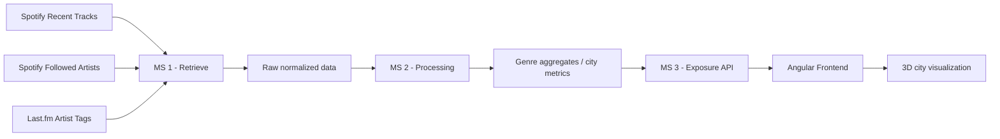
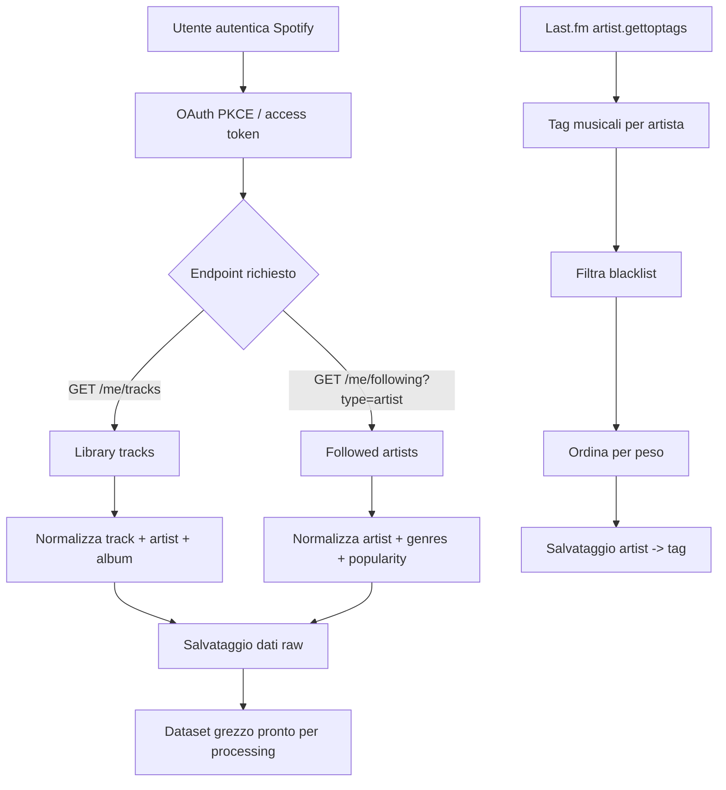
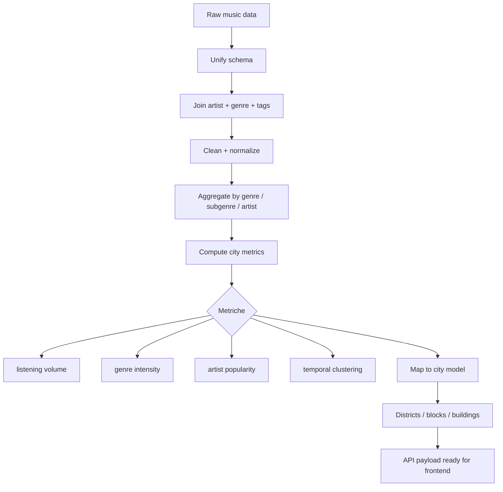
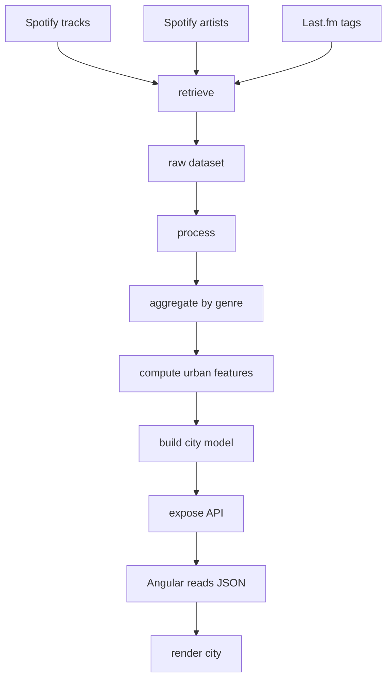

# Cityfy

Cityfy è un progetto che trasforma i dati musicali personali in una rappresentazione urbana generativa.
L’idea centrale è semplice: i brani ascoltati, i generi e i sotto-generi diventano elementi di una città, dove ogni quartiere, blocco e edificio rappresenta un aspetto del profilo musicale dell’utente.

L’obiettivo è costruire una “città dell’ascolto” partendo da dati provenienti da Spotify e arricchiti con metadata di artisti e tag musicali da Last.fm. Il risultato finale è una visione grafica della propria identità musicale, resa come una mappa urbana o una scena 3D in cui:

- il genere diventa un quartiere
- il sotto-genere diventa una zona o un blocco
- l’artista diventa un edificio
- l’intensità di ascolto definisce l’altezza e la densità

---

## Architettura del progetto

Il progetto è pensato come una pipeline in 3 parti:

1. Retrieve
   - recupero dati grezzi da Spotify
   - recupero metadata di artisti e generi
   - arricchimento da Last.fm
   - salvataggio dei dati raw

2. Processing
   - pulizia e normalizzazione
   - aggregazione per genere, sotto-genere e artista
   - trasformazione in feature urbane
   - costruzione del modello città

3. Exposure API
   - esposizione dei dati elaborati
   - endpoint REST per il frontend
   - consumo da Angular per la visualizzazione

---

## Flusso alto livello



---

## 1) Retrieve

La prima parte del sistema raccoglie dati grezzi da fonti esterne. Nel progetto attuale i flussi principali sono implementati in:

- [spotify_data/spotify_library.py](spotify_data/spotify_library.py)
- [spotify_data/spotify_artist_follow.py](spotify_data/spotify_artist_follow.py)
- [spotify_data/lastfm_genres.py](spotify_data/lastfm_genres.py)

### Flusso di retrieve



### Dati recuperati

Da Spotify:
- tracce ascoltate
- artisti seguiti
- generi associati agli artisti
- popularity e follower count
- album e artist metadata

Da Last.fm:
- top tags per artista
- classificazione per genere e sotto-genere
- in particolare i tag che descrivono il profilo musicale dell’artista

### Esempio di dati grezzi

```json
{
  "trackId": "abc123",
  "trackName": "Midnight City",
  "artistId": "artist1",
  "artistName": "M83",
  "albumId": "album1",
  "albumName": "Hurry Up, We're Dreaming",
  "addedAt": "2026-09-01T10:22:00Z",
  "durationMs": 270000,
  "genres": ["electronic", "indie pop"]
}
```

---

## 2) Processing

Una volta raccolti i dati grezzi, si applica la fase di elaborazione. L’obiettivo è trasformare il profilo musicale in una struttura urbana.

### Flusso di processing



### Logica di trasformazione

La mappatura logica è la seguente:

- genere principale → quartiere
- sotto-genere → blocco o zona
- artista → edificio o cluster di edifici
- numero di ascolti → altezza edificio
- intensità del genere → densità del quartiere
- categoria musicale → colore del quartiere / edificio

### Esempio di trasformazione

```text
electronic
  -> quartiere "Electronic District"
  -> colore blu / verde
  -> densità alta se l'utente ascolta molto musica elettronica

house / deep house / techno
  -> sotto-zone del quartiere
  -> blocchi con altezza variabile in base al listening score

M83 / Daft Punk / Massive Attack
  -> edifici distinti
  -> altezza proporzionale alla frequenza di ascolto
```

---

## 3) Exposure API

La terza parte del sistema espone i dati elaborati tramite API REST; il frontend Angular si occupa poi della renderizzazione grafica.

### Obiettivo delle API
- restituire la città generata
- restituire aggregati per genere
- restituire dettagli per quartiere / blocco / artista
- filtrare dati per periodo, genere o artista

### API proposal

```http
GET /api/city
GET /api/city?period=30d
GET /api/genres
GET /api/districts
GET /api/artists/{artistId}
GET /api/genres/{genre}
```

### Esempio payload di risposta

```json
{
  "cityId": "user-spotify-city",
  "generatedAt": "2026-09-12T00:00:00Z",
  "period": "30d",
  "summary": {
    "totalTracks": 1240,
    "totalArtists": 89,
    "topGenres": ["electronic", "rock", "hiphop"]
  },
  "districts": [
    {
      "districtId": "electronic",
      "name": "Electronic District",
      "color": "#4cc9f0",
      "density": 0.82,
      "listeningIntensity": 92.4,
      "buildings": [
        {
          "buildingId": "artist1",
          "name": "M83",
          "height": 26.5,
          "width": 10,
          "color": "#4cc9f0",
          "score": 92.4
        }
      ]
    }
  ]
}
```

---

## 4) Modello backend / domain model

Il backend dovrebbe lavorare con un modello concettuale come questo.

### TrackRecord

```json
{
  "trackId": "abc123",
  "trackName": "Midnight City",
  "artistId": "artist1",
  "artistName": "M83",
  "albumId": "album1",
  "albumName": "Hurry Up, We're Dreaming",
  "addedAt": "2026-09-01T10:22:00Z",
  "durationMs": 270000,
  "genres": ["electronic", "indie pop"],
  "source": "spotify"
}
```

### ArtistProfile

```json
{
  "artistId": "artist1",
  "artistName": "M83",
  "genres": ["electronic", "indie pop"],
  "popularity": 90,
  "followers": 15400000,
  "topTags": ["electronic", "indie", "dream pop"],
  "macroGenre": "electronic"
}
```

### GenreAggregate

```json
{
  "genre": "electronic",
  "subgenres": ["house", "deep house", "techno"],
  "trackCount": 420,
  "artistCount": 35,
  "listeningScore": 92.4
}
```

### CityDistrict

```json
{
  "districtId": "electronic",
  "name": "Electronic District",
  "color": "#4cc9f0",
  "density": 0.82,
  "listeningIntensity": 92.4,
  "buildings": []
}
```

---

## 5) Come dovrebbe essere l’Angular

Il frontend non è solo un semplice viewer: è il layer di presentazione del modello della città.

L’app Angular dovrebbe avere una struttura simile a questa:

```text
app/
  core/
    services/
      city.service.ts
      genre.service.ts
      filters.service.ts

  features/
    city/
      components/
        city-view/
        city-scene/
        district-legend/
      models/
        city.model.ts
        building.model.ts

    filters/
      components/
        genre-filter/
        period-filter/
        artist-search/

  shared/
    components/
      metric-card/
      loading-state/
      empty-state/
```

### Responsabilità dell’Angular

- chiamare l’API di city
- ricevere il JSON del modello
- trasformare i dati in scena grafica
- supportare filtri per genere, artista, periodo
- mostrare un layout urbano con quartieri e edifici

### Logica di rendering

- quartiere = zona della città
- edificio = artista o cluster di artisti
- altezza = intensità di ascolto
- colore = genere / macro-genere
- densità = numero di tracce o ascolti

---

## 6) Flusso completo dal dato alla città



---

## 7) Idea di valore del progetto

Cityfy non è solo una visualizzazione musicale. È una rappresentazione dell’identità sonora dell’utente in forma urbana:

- il tuo consumo musicale diventa paesaggio
- i generi diventano aree geografiche
- la storia dell’ascolto diventa una città dinamica

Questo rende il progetto interessante non solo come app visiva, ma come strumento di analisi del proprio comportamento musicale.

---

## 8) Stack tecnologico

### Attuale
- Vite
- JavaScript / vanilla
- Three.js
- Python per il retrieval e il processing dati

### Evoluzione prevista
- Angular per il frontend
- API REST per l’esposizione
- backend in Node.js o ASP.NET o Java secondo preferenza
- database leggero per dati aggregati (JSON / SQLite / Postgres)

---

## 9) Prossimi step

1. separare il layer di retrieve in microservizio dedicato
2. definire un modello concreto di city JSON
3. creare la struttura Angular di base
4. implementare le API REST
5. collegare il frontend al backend
6. sostituire la città statica con dati dinamici provenienti dalle API

---

## 10) Conclusione

Cityfy combina due elementi:
- analisi dati musicali
- visualizzazione urbana

La sua forza è la trasformazione del comportamento di ascolto in un modello spaziale, dove la città non è un ambiente generico ma una rappresentazione delle tue preferenze musicali.

Questo rende il progetto perfettamente coerente con una architettura a 3 livelli:
- retrieve
- processing
- exposure API
- con Angular come layer di presentazione visiva.
